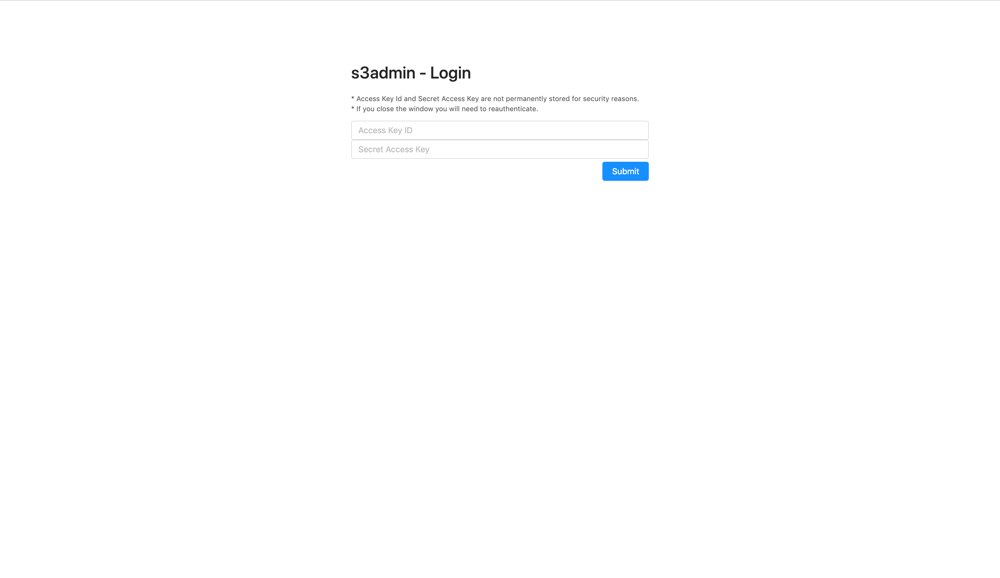
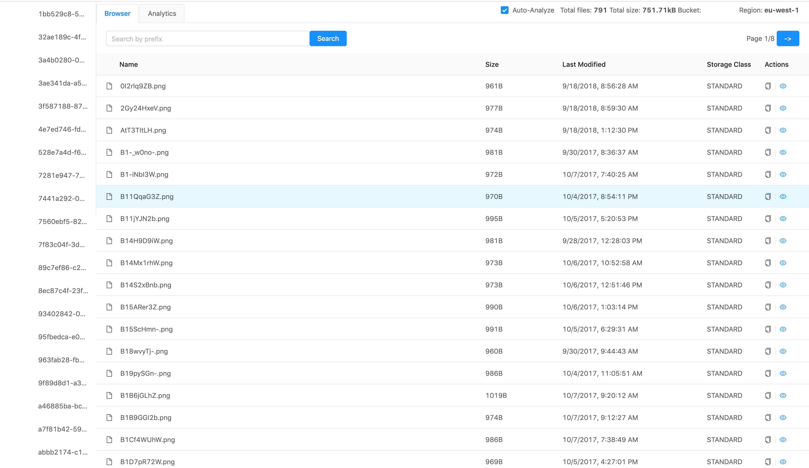
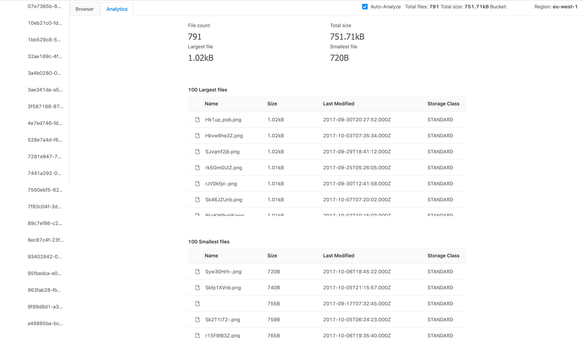

# 🤖 s3admin

Browse your buckets and check usage without the need to log into AWS Console

## Features

- **Browse** your Buckets and Objects
  <!-- - Set a custom **Delimiter** -->
- **Search** by Prefix
- **Analyze** Bucket size & Object count
- **List** largest and smallest files
- **Secure** - your credentials are not stored
- **Standalone** - node.js app
- **One click deploy** to Heroku
- **Deploy anywhere** with Docker

## Screenshots

## Requirements

Programmatic usage credentials from AWS IAM with the proper ACL settings to access your S3 buckets (Access Key ID, Secret Access Key)

## Demo

<a href="https://s3admin-demo.herokuapp.com/" target="_blank">-> Demo <-</a>

## Deploy

#### Heroku

#### Docker

    docker run -p 8000:3000 omaksi/s3admin

## Development

Node.js and yarn required

    yarn
    yarn run dev

## TODO

- Bucket Settings

## Contributing

Please open an issue :)

## License

MIT
